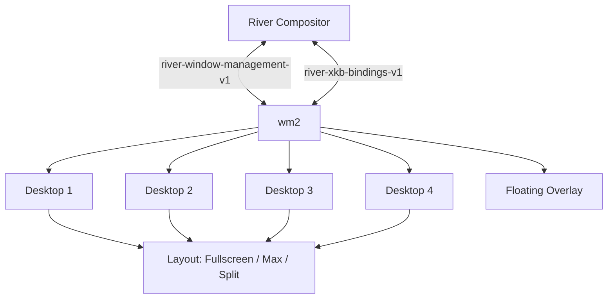

# wm2

A window manager for the [River](https://codeberg.org/river/river) Wayland compositor (v0.4+), written in Python 3. It implements the `river-window-management-v1` and `river-xkb-bindings-v1` protocols to provide an opinionated workflow with **4 desktops**, a **floating overlay stack**, and **3 layout modes**.

## Features

**Desktop Management.** The window manager provides 4 independent numbered desktops (1–4), each with its own layout mode and window stack. Switching between desktops is instant — the previous desktop's windows are hidden and the new desktop's windows are shown. A window belongs to exactly one desktop (or the floating overlay stack).

**Floating Overlay Stack.** A separate floating context renders on top of the current desktop. When activated, the user "enters" the floating stack and can freely position and resize windows using the pointer. The underlying desktop remains visible beneath the overlay.

**Three Layout Modes.** Each desktop independently supports three layout modes, switchable via keybindings:

| Mode | Description |
|------|-------------|
| **Fullscreen** | The focused window occupies the entire output (no gaps, no borders, covers panels). Other windows are hidden behind it. Cycling windows changes which window is fullscreen. |
| **Max** | The focused window occupies the entire usable area (respects panels/bars). Only one window is visible at a time — a monocle layout. |
| **2-Split** | The output is divided into two equal horizontal halves (left 50%, right 50%). Each side has its own ordered stack; only the top window on each side is visible. New windows are auto-balanced to the empty side when the focused side already has a window. |

**Focus Management.** Keyboard focus is explicitly managed by the WM. In max/fullscreen modes, focus is always on the single visible window. In 2-split mode, focus is on one of the two visible windows and can be moved between sides.

## Requirements

The following are required to run wm2:

- **River** compositor `main` branch (pre-0.4.0) or 0.4.0+ with `river-window-management-v1` protocol support
- **Python 3.11+**
- **pywayland** (`pip install pywayland`)
- A Wayland-compatible terminal emulator (default: `foot`)
- An application launcher (default: `fuzzel`)

## Installation

```bash
# Clone the repository
git clone https://github.com/YOUR_USERNAME/wm2.git
cd wm2

# Install Python dependencies
pip install pywayland

# Generate protocol bindings (already included, but can be regenerated)
python3 -m pywayland.scanner \
  -i /usr/share/wayland/wayland.xml \
     river-window-management-v1.xml \
     river-xkb-bindings-v1.xml \
     river-xkb-config-v1.xml \
     river-input-management-v1.xml \
  -o protocols/

# Make the main script executable
chmod +x wm2.py
```

## Usage

wm2 is launched as part of your River init script. It connects to the Wayland display, binds the window management protocol, and enters its event loop.

```bash
# Launch directly (River must be running)
python3 /path/to/wm2/wm2.py &
```

### Sample River Init Script

Place the following in `~/.config/river/init` and make it executable:

```bash
#!/bin/sh

# Start the window manager
python3 /path/to/wm2/wm2.py &

# Optional: start a status bar
# waybar &

# Optional: set wallpaper
# swaybg -i /path/to/wallpaper.png &
```

## Default Keymap

All bindings use the **Super** (Logo) key as the primary modifier.

### Desktop Management

| Keybinding | Action |
|------------|--------|
| `Super + 1` | Switch to desktop 1 |
| `Super + 2` | Switch to desktop 2 |
| `Super + 3` | Switch to desktop 3 |
| `Super + 4` | Switch to desktop 4 |
| `Super + Shift + 1` | Move focused window to desktop 1 |
| `Super + Shift + 2` | Move focused window to desktop 2 |
| `Super + Shift + 3` | Move focused window to desktop 3 |
| `Super + Shift + 4` | Move focused window to desktop 4 |
| `Super + Space` | Toggle floating overlay |
| `Super + Shift + Space` | Move focused window to floating overlay |

### Layout Control

| Keybinding | Action |
|------------|--------|
| `Super + F` | Switch to fullscreen mode |
| `Super + M` | Switch to max (monocle) mode |
| `Super + S` | Switch to 2-split mode |

### Window Navigation

| Keybinding | Action |
|------------|--------|
| `Super + J` | Cycle to next window in stack |
| `Super + K` | Cycle to previous window in stack |
| `Super + Tab` | Move focus to other side (2-split mode) |
| `Super + N` | Cycle window on current side (2-split mode) |

### Window Manipulation

| Keybinding | Action |
|------------|--------|
| `Super + O` | Move window to other side (2-split mode) |
| `Super + Shift + K` | Move window up in side's stack (2-split mode) |
| `Super + Shift + J` | Move window down in side's stack (2-split mode) |
| `Super + Shift + Q` | Close focused window |

### General

| Keybinding | Action |
|------------|--------|
| `Super + Return` | Spawn terminal |
| `Super + D` | Spawn application launcher |
| `Super + Left Click` | Interactive move (floating windows) |
| `Super + Right Click` | Interactive resize (floating windows) |

## Configuration

An optional TOML configuration file can be placed at `~/.config/wm2/config.toml`. If the file does not exist, sensible defaults are used.

### Example Configuration

```toml
# Terminal emulator command
terminal = "foot"

# Application launcher command
launcher = "fuzzel"

# Border width in pixels (0 to disable)
border_width = 2

# Default layout mode: "fullscreen", "max", or "split"
default_layout = "max"

[xkb]
layout = "us"
model = "pc105"
variant = "altgr-intl"
options = "ctrl:nocaps,compose:rctrl"
```

## Architecture



The window manager operates as a standalone Wayland client process. It communicates with the River compositor through a two-phase commit model:

1. **Manage Sequence**: The compositor sends state changes (new windows, closed windows, input events) followed by a `manage_start` event. The WM responds by modifying window management state (dimensions, focus, fullscreen) and sends `manage_finish`.

2. **Render Sequence**: The compositor sends updated window dimensions followed by a `render_start` event. The WM responds by setting positions, visibility, z-order, and borders, then sends `render_finish`.

This separation ensures frame-perfect atomic updates — all state changes are applied together in a single frame.

## Project Structure

```
wm2/
├── wm2.py              # Main window manager implementation
├── protocols/                # Generated pywayland protocol bindings
│   ├── river_window_management_v1/
│   ├── river_xkb_bindings_v1/
│   ├── river_xkb_config_v1/
│   ├── river_input_management_v1/
│   └── wayland/
├── config.toml.example       # Example configuration file
├── init.example              # Example River init script
└── README.md                 # This file
```

## License

MIT
